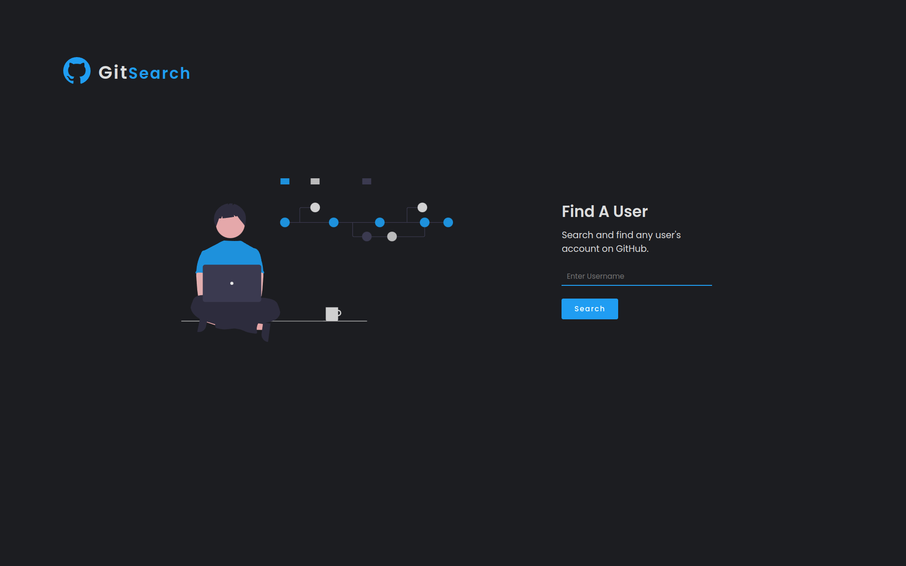

# GitSearch



### By: Samuel Martins

## Table of Content

- [Description](#description)
- [Installation Requirement](#usage)
- [Technology Used](#technologies)
- [Licence](#licence)
- [Authors Info](#author-info)

## Description

This is a simple Angular project that makes use of the github API to search for users and displays their information.[live site](https://gitsearch7.netlify.app/)

## Behaviour Driven Development

The user is able to;

- Type into the search field to get a user's account

- See relevant information about searched user

- Navigate to the user's repositories

## Usage

### Requirements

- Either a computer, phone, tablet or an Ipad

- An access to the Internet

### 1. Local Repository

- Make sure you have a stable internet to have the ability to clone the repository.
- Type the following command in your terminal to clone this repository

```
git clone https://github.com/thesmartcoder7/gitsearch.git
```

If you are using SSH, use the following command

```
git clone git@github.com:thesmartcoder7/gitsearch.git
```

When you run the commands successfully, you should have a local version of this repository.

- Before running the application, make sure you have angular CLI, nodejs (best choice LTS), and nmp installed on your machine

- use the command below to start the application and lauch it in your browser

```
ng serve --open
```

### 2. Online Repository

- Make sure you have a stable internet for forking this repository.
- According to the license, you can fork this project. You need to click on the forking icon and it will be added as one of your repositories

Feel free to fork the project and have fun with it. Happy coding!

## Further help

To get more help on the Angular CLI use `ng help` or go check out the [Angular CLI Overview and Command Reference](https://angular.io/cli) page.

## Technologies

- HTML5
- CSS3
- JavaScript
- Angular
- Typescript

## Licence

Copyright (c) Samuel Martins - [MIT Licence](LICENSE)

## Author Info

- Twitter - [@thesmartcoder7](https://twitter.com/thesmartcoder7)
- Linkedin - [Samuel Martins](https://www.linkedin.com/in/samuel-martins-09839b115/)
- Website - [Samuel Martins](https://smart-code.dev)
- blog - [Samuel Martins](https://samuel-martins.medium.com/)

This project was generated with [Angular CLI](https://github.com/angular/angular-cli) version 13.3.0.
